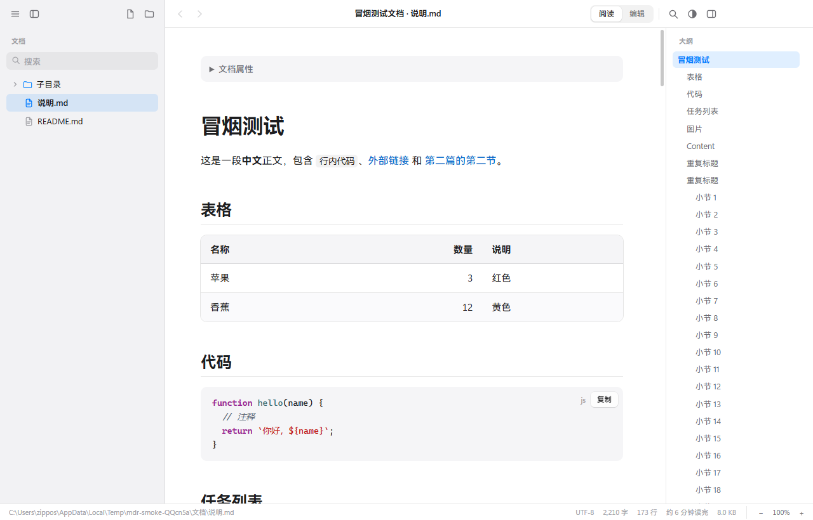
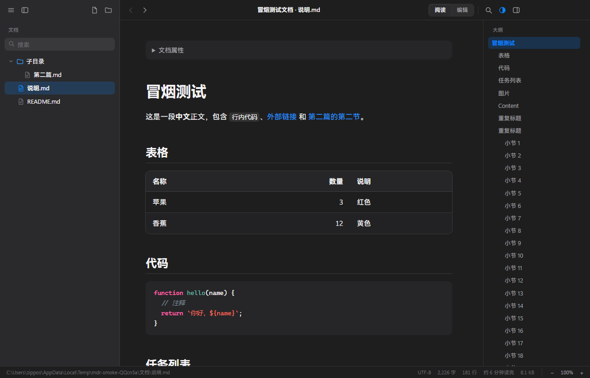
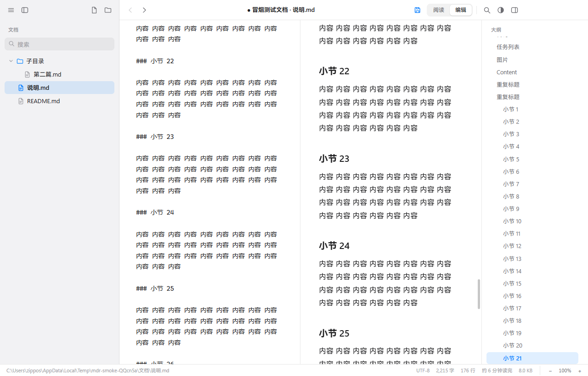
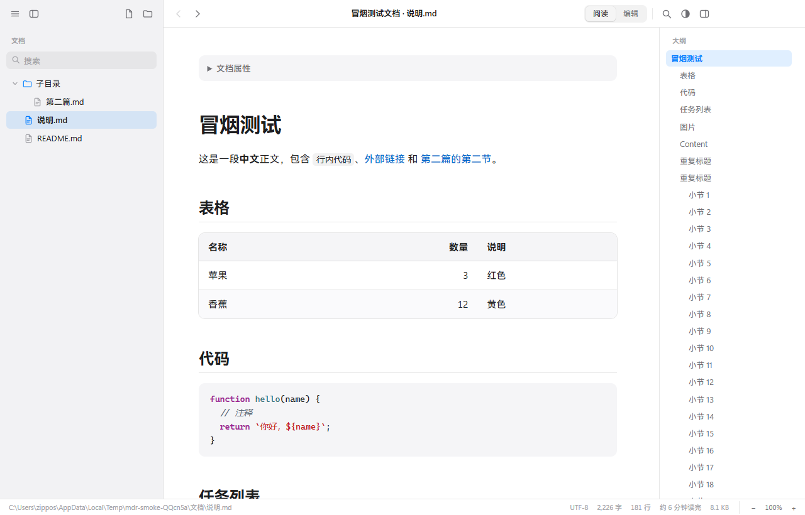
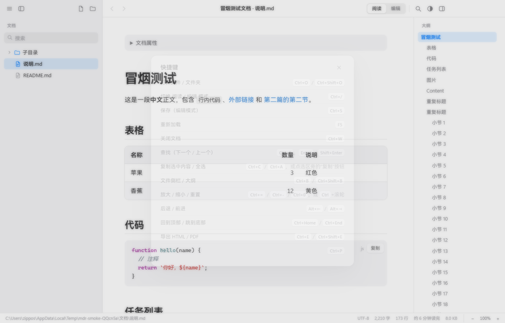

# QH阅读（qh-reader）

一个本地化的 Markdown 文件阅读器，基于 Electron 构建。纯本地运行，无网络依赖，专注阅读体验，也支持轻量编辑。

## 功能特性

- **阅读模式**：markdown-it + highlight.js 渲染，支持代码高亮、任务列表、front matter「文档属性」折叠块、表格横向滚动、代码块一键复制、`<details>` 折叠
- **编辑模式**：左侧源码 + 右侧实时预览（200ms 防抖），Tab / Shift+Tab 多行缩进，回车自动延续列表（含任务列表），Markdown 语法速查面板点击插入
- **编辑 ↔ 预览双向滚动同步**：按相邻标题区间线性插值联动，标题处精确对齐、标题间持续跟随；超 5 万行自动降级为估算避免卡顿
- **文件侧栏**：目录树只显示含 Markdown 的目录，自动跳过 `node_modules` / `.git` 等；支持过滤搜索、宽度拖动、一键刷新
- **大纲导航**：标题目录 + 滚动高亮跟随
- **文内查找**：不区分大小写，最多 5000 个命中，高亮标记，`Enter` / `Shift+Enter` 跳转
- **导航历史**：后退 / 前进并恢复滚动位置，支持鼠标侧键，上限 100 条
- **明暗主题**：跟随系统 / 浅色 / 深色三态
- **缩放**：50%–250%，支持 `Ctrl+滚轮`
- **导出**：HTML（本地图片自动内嵌为 data URI，导出文件可随处打开）、PDF、打印
- **文件监视**：磁盘上的文件被外部修改后自动刷新（MD5 对比去抖）
- **单实例复用**：再次双击 `.md` 文件复用已打开的窗口；拖放文件 / 文件夹直接打开
- **多编码支持**：UTF-8（含 BOM）/ UTF-16 LE / GBK 自动识别；保存时尽量保持原编码与换行符（GBK 转存 UTF-8 并提示）

## 安装

从 [Releases](https://github.com/zipposs/qh-reader/releases) 下载：

| 包 | 说明 |
| --- | --- |
| `QH阅读 Setup x.x.x.exe` | NSIS 安装版，支持自定义安装目录、创建桌面快捷方式 |
| `QH阅读-便携版-x.x.x.exe` | 便携版，免安装，双击即用 |

安装后会注册 `.md` / `.markdown` 文件关联。程序未签名，首次运行时 SmartScreen 可能提示「未知发布者」，点击「更多信息 → 仍要运行」即可。

## 界面预览

| 浅色主题 | 深色主题 |
| --- | --- |
|  |  |

| 编辑模式（源码 + 实时预览） | 欢迎页 |
| --- | --- |
|  |  |

> 快捷键一览（`F1` 打开）：



## 使用

- **打开**：`Ctrl+O` 打开文件，`Ctrl+Shift+O` 打开文件夹，或直接把文件 / 文件夹拖到窗口
- **阅读 / 编辑切换**：`Ctrl+/`
- **保存**：`Ctrl+S`（编辑模式下）
- **查找**：`Ctrl+F`
- **侧栏 / 大纲**：`Ctrl+B` / `Ctrl+Shift+B`
- **导出 HTML / PDF**：`Ctrl+E` / `Ctrl+Shift+E`
- 完整快捷键清单：菜单「帮助 → 快捷键」（`F1`）

## 开发

```bash
npm install          # 安装依赖
npm start            # 本地运行（Electron 开发模式）
```

> 注意：npm 11 会拒绝 `.npmrc` 中旧版镜像 key 配置。若遇到 `npm start` 启动异常，可直接用本地二进制运行：
>
> ```bash
> node node_modules/electron/cli.js .
> ```

### 打包

```bash
npm run dist         # 或直接调用本地二进制：node node_modules/electron-builder/cli.js --win
```

产物输出到 `release/`：NSIS 安装版 + 便携版。

### 测试

```bash
node node_modules/electron/cli.js scripts/smoke.js
```

冒烟测试用临时数据目录启动应用，打开示例文档，逐项断言界面状态并截图（43 项检查）。另有 `scripts/verify-*.js` 系列脚本，针对编辑模式滚动同步的专项回归。

## 技术栈

| 组件 | 选型 |
| --- | --- |
| 运行时 | Electron 37 |
| Markdown 渲染 | markdown-it 14 |
| 代码高亮 | highlight.js 11 |
| 打包 | electron-builder 26 |

## 安全设计

- 严格隔离：`contextIsolation` + `sandbox` + `nodeIntegration: false`，页面只能通过 preload 暴露的受限 API 与主进程通信
- 严格 CSP：`default-src 'none'`，页面内无法发起任何网络请求
- 双重防 XSS：CSP 之外还有一层 DOM 清理（移除脚本标签、`on*` 事件属性、`javascript:` URL）
- 危险操作护栏：外部链接仅放行 `http(s)/mailto` 交系统浏览器；文档链接到的可执行文件只定位不运行

## License

[MIT](./LICENSE) © zippos
